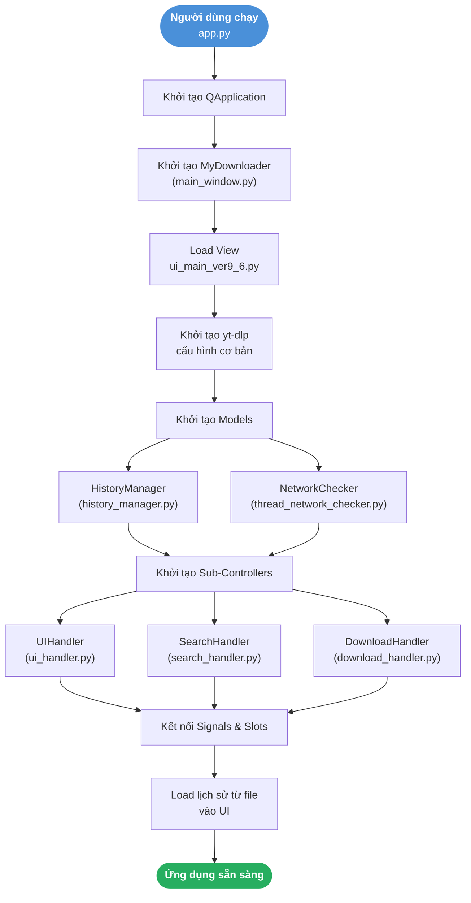
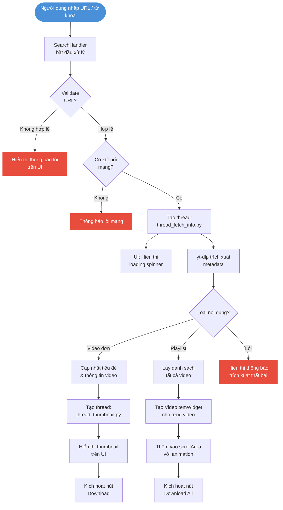
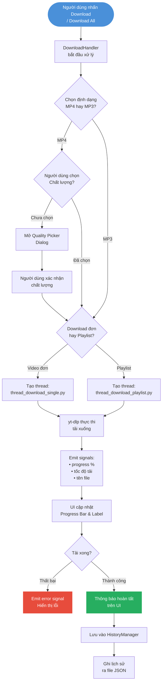
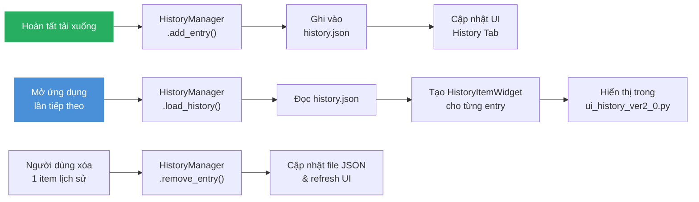
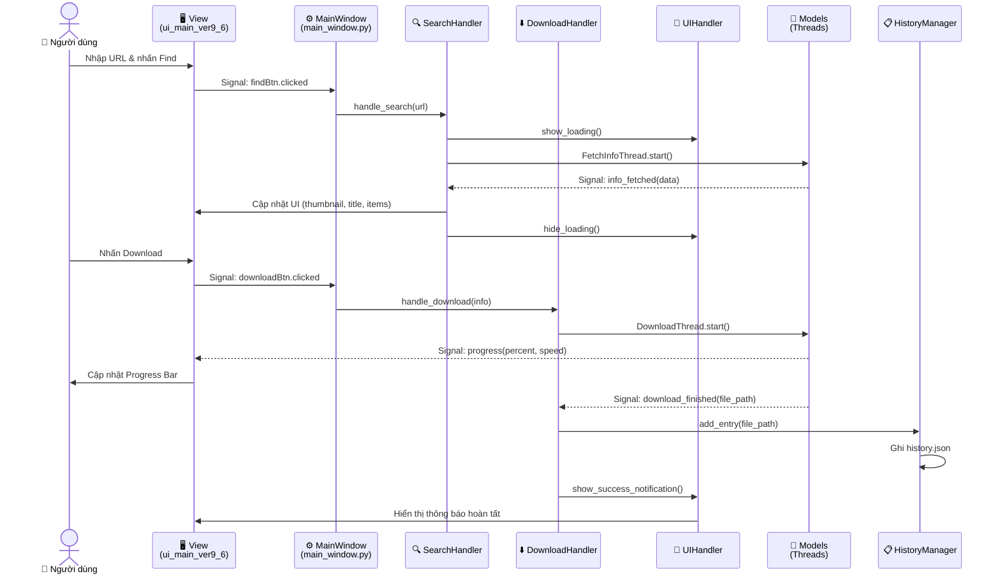

# Luồng Hoạt Động (Workflow) — Youtube Playlist Downloader

> Tài liệu này mô tả chi tiết toàn bộ luồng hoạt động của ứng dụng, từ khởi động đến hoàn tất tải xuống. Kiến trúc dự án theo mô hình **MVC** (Model–View–Controller), sử dụng **PySide6** cho giao diện và **yt-dlp** để xử lý video.

---

## Mục lục

1. [Kiến trúc tổng quan](#1-kiến-trúc-tổng-quan)
2. [Luồng khởi động ứng dụng](#2-luồng-khởi-động-ứng-dụng)
3. [Luồng tìm kiếm & trích xuất thông tin](#3-luồng-tìm-kiếm--trích-xuất-thông-tin)
4. [Luồng tải xuống](#4-luồng-tải-xuống)
5. [Luồng quản lý lịch sử](#5-luồng-quản-lý-lịch-sử)
6. [Sơ đồ tương tác đầy đủ](#6-sơ-đồ-tương-tác-đầy-đủ)
7. [Cấu trúc file dự án](#7-cấu-trúc-file-dự-án)

---

## 1. Kiến trúc tổng quan

```
src/
├── app.py                          # Entry point
├── controllers/
│   ├── main_window.py              # MyDownloader — controller chính
│   ├── ui_handler.py               # Xử lý hiệu ứng & trạng thái UI
│   ├── search_handler.py           # Xử lý tìm kiếm & trích xuất metadata
│   ├── download_handler.py         # Điều phối tải xuống
│   └── download_dialog_controller.py  # Controller cho dialog tải
├── models/
│   ├── history_manager.py          # Quản lý lịch sử
│   ├── thread_fetch_info.py        # Thread: lấy metadata yt-dlp
│   ├── thread_thumbnail.py         # Thread: tải thumbnail
│   ├── thread_download_single.py   # Thread: tải video đơn
│   ├── thread_download_playlist.py # Thread: tải toàn bộ playlist
│   └── thread_network_checker.py   # Thread: kiểm tra mạng
├── views/
│   ├── ui_main_ver9_6.py           # Giao diện chính
│   ├── ui_video_ver6_2.py          # Widget hiển thị từng video
│   ├── ui_history_ver2_0.py        # Giao diện lịch sử
│   ├── ui_download_dialog_ver1_0.py# Giao diện dialog tải
│   ├── custom_widgets.py           # Các widget tùy chỉnh
│   ├── history_item1_5.py          # Widget item lịch sử
│   └── ui_config.py                # Cấu hình giao diện
└── utils/
    └── helpers.py                  # Các hàm tiện ích dùng chung
```

---

## 2. Luồng khởi động ứng dụng



---

## 3. Luồng tìm kiếm & trích xuất thông tin



---

## 4. Luồng tải xuống



---

## 5. Luồng quản lý lịch sử



---

## 6. Sơ đồ tương tác đầy đủ

Sơ đồ dưới đây thể hiện mối liên hệ giữa các tầng kiến trúc (View → Controller → Model).



---

## 7. Cấu trúc file dự án

```
ytb_playlist_downloader/
├── app.py                          # 🚀 Entry point
├── requirements.txt                # 📦 Dependencies
├── docs/
│   ├── workflow.md                 # 📄 File này — tài liệu luồng hoạt động
│   ├── UI_VERSIONING_GUIDE.md      # 📄 Hướng dẫn versioning UI
│   └── ideas/                      # 💡 Ý tưởng tính năng mới
│       └── drag_drop_queue.md
├── src/
│   ├── app.py
│   ├── controllers/
│   │   ├── main_window.py
│   │   ├── ui_handler.py
│   │   ├── search_handler.py
│   │   ├── download_handler.py
│   │   └── download_dialog_controller.py
│   ├── models/
│   │   ├── history_manager.py
│   │   ├── thread_fetch_info.py
│   │   ├── thread_thumbnail.py
│   │   ├── thread_download_single.py
│   │   ├── thread_download_playlist.py
│   │   └── thread_network_checker.py
│   ├── views/
│   │   ├── ui_main_ver9_6.py
│   │   ├── ui_video_ver6_2.py
│   │   ├── ui_history_ver2_0.py
│   │   ├── ui_download_dialog_ver1_0.py
│   │   ├── custom_widgets.py
│   │   ├── history_item1_5.py
│   │   └── ui_config.py
│   └── utils/
│       └── helpers.py
├── ui/                             # 🎨 File .ui và .qss gốc (Qt Designer)
├── img/                            # 🖼️ Tài nguyên hình ảnh
└── bin/                            # 🔧 File thực thi / build output
```

---

*Cập nhật lần cuối: 2026-06-18*
